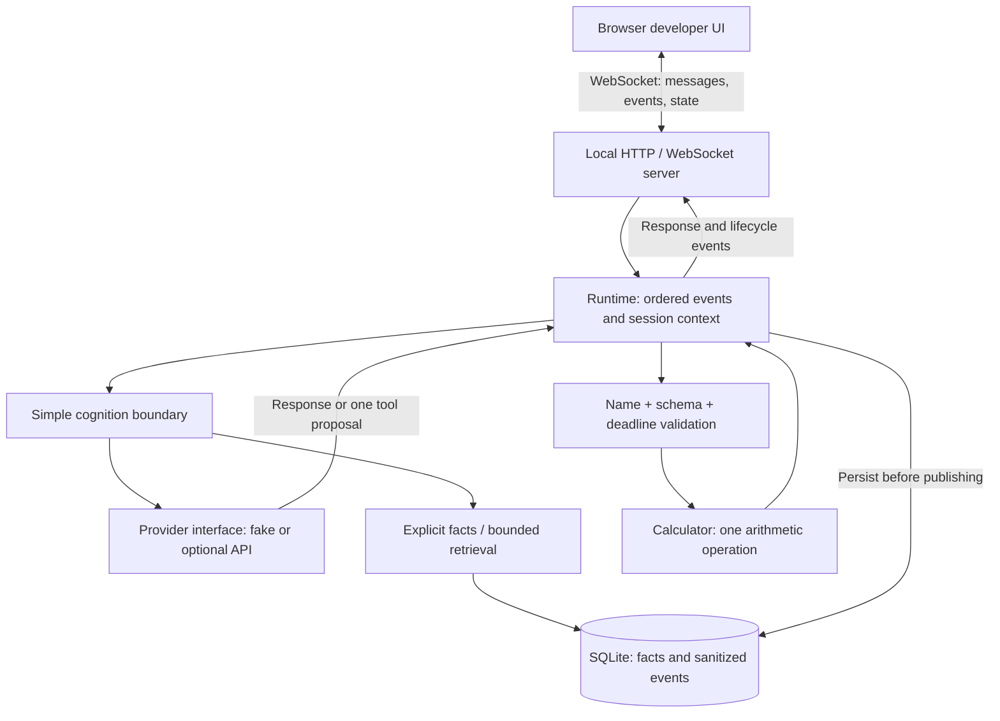

# Realtime AI Runtime Reference

A compact reference implementation of a realtime AI application runtime demonstrating event-driven cognition, persistent SQLite memory, provider abstraction, WebSocket communication, bounded tool execution, observability, and deterministic testing.

**Start here:** run the offline demo, then read [`src/runtime/runtime.ts`](src/runtime/runtime.ts). The request path is intentionally small enough to understand in 5–10 minutes.

This is an independent public reference implementation, not the production Vex system. It contains no production code, prompts, memory policy, integrations, or compatibility layer. Its scope makes no claim to represent the complexity of a production AI character system.

## Quick start

Requires **Node.js 24+** (built-in SQLite) and **pnpm 11**. No API key, Docker, or external service is required.

```bash
pnpm install
pnpm dev
```

Open [http://127.0.0.1:5173](http://127.0.0.1:5173). Vite proxies the WebSocket to the runtime on port 3000. Run commands from the repository root. The development proxy expects the default runtime port.

For a compiled local build:

```bash
pnpm build
pnpm start
```

Open [http://127.0.0.1:3000](http://127.0.0.1:3000). `GET /health` returns runtime status and the provider type. Both servers bind to loopback. This is a local demonstration, without deployment authentication.

## Two-minute walkthrough

1. Send **“What can this runtime do?”**. Watch `chat.received → cognition.started → memory.read → cognition.completed → response.completed` appear. Expand an event to inspect its correlation ID and sanitized metadata.
2. Send **“Remember that the project codename is Orion.”**. A deterministic application rule stores the explicit fact in SQLite; the memory panel updates. The provider cannot write memory.
3. Click **New session**. The conversation clears and the session ID changes, while the saved fact remains. Ask **“What is the project codename?”**. Nova answers **Orion**. Restart the server and ask again to verify durability.
4. Send **“What is 843 * 27?”**. The provider proposes `calculator`, validated input executes, and the result **22761** returns. `tool.requested` and `tool.completed` expose the capability boundary.

The fake provider recognizes these examples, simple two-operand arithmetic, and questions about the previous message. It is a deterministic demo adapter, not a general language model. Explicit facts use **`Remember that [the] <key> is <value>.`**; the optional final period is punctuation. Keys normalize to lowercase, and repeat writes update the same fact.

## Architecture



There is no generalized event bus. The runtime is an explicit sequence of operations; each event is saved before it is logged and sent. Messages within one connection cannot execute concurrently. Each turn has a correlation ID. Connections get independent transient context and share the local demo's durable facts. The memory panel is a snapshot refreshed on connection, reset, and that connection's explicit write.

**Two kinds of state:** recent conversation exists only in RAM (12 messages per session); explicit facts persist in SQLite (32 facts, bounded key/value lengths). New sessions clear the first and retain the second. Sanitized lifecycle events also persist, independently of conversation content.

**One capability:** the calculator takes `{ left, operator, right }`, with finite operands bounded to ±10¹² and an operator in `+ - * /`. No expression evaluation. At most one tool per request; its result becomes a deterministic final response, with no recursive model loop.

## Developer UI

The interface shows conversation, connection/provider/session status, sanitized lifecycle events, and persistent facts. Event metadata excludes messages, raw prompts, memory values, provider errors, and credentials. Chat replies and facts are separate UI packets; they are not copied into logs or the event table.


<!-- Screenshot placeholder for future UI changes: replace docs/screenshot.png after the demo steps. -->

## Repository map

```text
src/
  runtime/runtime.ts       Ordered turns, session context, durable event emission
  cognition/decide.ts      Explicit memory grammar and bounded provider request
  events/types.ts          Small typed lifecycle event model
  memory/store.ts          SQLite migrations, facts, event persistence
  providers/              Interface, offline fake, optional API adapter
  tools/calculator.ts     Single capability, validation, timeout, structured outcomes
  server/                 HTTP health/static assets and WebSocket protocol
ui/                       React developer interface, responsive CSS
tests/                    Deterministic units and real WebSocket integration
docs/                     Architecture and security boundaries
```

## Verification

```bash
pnpm test
pnpm typecheck
pnpm lint
pnpm build
```

Tests exercise deterministic fake responses, provider failure and timeout, correlated event order, explicit writes and recall after session reset/database reopen, context limits, input validation, unknown tools, tool timeout/failure, actual WebSocket frames, malformed clients, origin/host restrictions, and frame/rate limits. Tests use temporary or in-memory SQLite databases; there is no API dependency.

## Optional provider

Copy `.env.example` to `.env`, set `PROVIDER=openai`, and provide your own HTTPS `OPENAI_BASE_URL`, `OPENAI_API_KEY`, and `OPENAI_MODEL`. Node loads `.env`; inherited variables take precedence. The endpoint must support chat completions and JSON object responses. No model or commercial endpoint is hard-coded. Only the optional provider adapter performs configured HTTP requests; the model cannot choose the destination.

Provider requests have a 10-second deadline; output is schema-checked and capped at 64 KiB. Redirects are rejected. Facts and bounded conversation are sent to the configured provider, so use only demo data. Real-provider compatibility requires manual verification against the chosen service; automated tests use simulated HTTP responses.

## Design and security boundaries

- No model shell, filesystem, browser, arbitrary HTTP, process execution, or dynamic tool loading. Unknown capabilities fail closed.
- Memory writes require the explicit application grammar. No inference, summarization, embeddings, reflection, learning, or autonomous extraction.
- The server accepts local Hosts and same-origin browser WebSockets; it caps connections, input sizes, message rates, and queued socket output.
- Logs contain lifecycle metadata and fixed error codes. Provider exceptions are never serialized. The local SQLite file contains intentional demo facts and event metadata and is ignored by Git.
- This is a single-process local reference. It has no user authentication, tenant isolation, encrypted database, event retention scheduler, streaming tokens, distributed ordering, or production availability guarantees. SQLite's event log grows until you remove the local database; event persistence is not crash recovery or replay machinery.

Speech, avatars, autonomous behavior, social/streaming integrations, multiple tools, model routing, learning, and production compatibility are intentionally omitted. See [architecture](docs/architecture.md) and [security boundaries](docs/security-boundaries.md).
