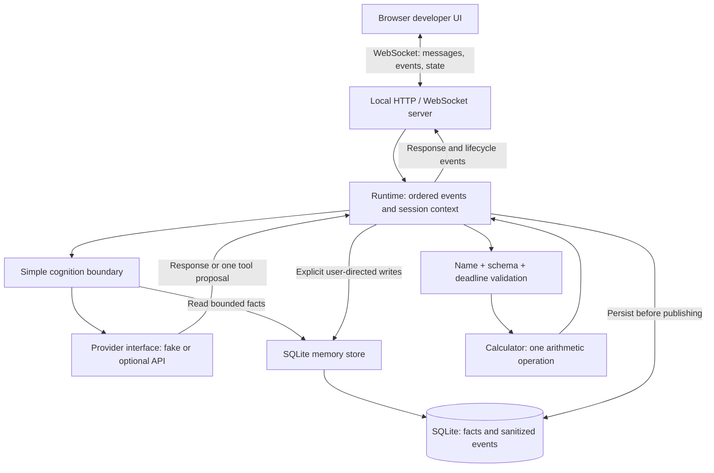
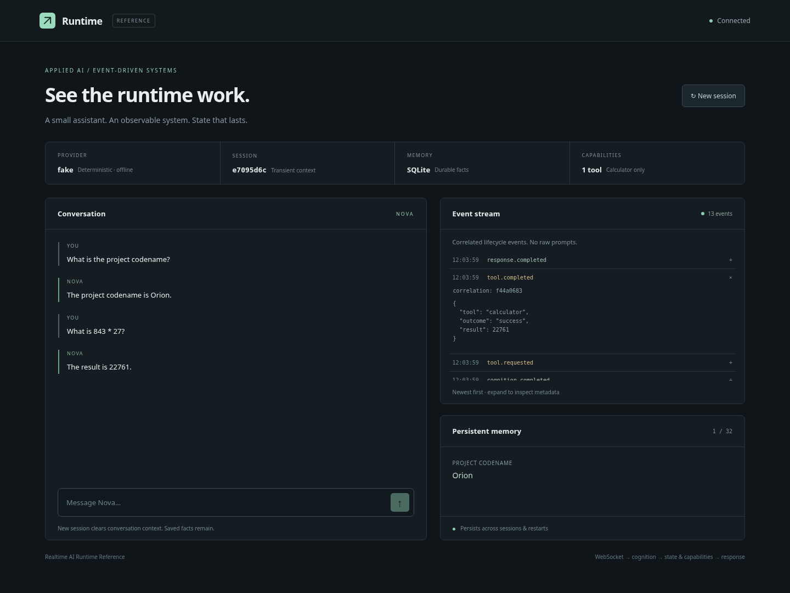

# Realtime AI Runtime Reference

A compact public implementation of core realtime AI runtime patterns: event-driven cognition and orchestration, durable SQLite memory, isolated providers, bounded tools, WebSocket communication, correlated observability, and deterministic testing.

**Deterministic offline demo · real SQLite persistence · real WebSocket integration tests · no API key required**

Transport, model calls, memory, tools, and logging each have different responsibilities. This runtime keeps them separate so the provider remains replaceable while state, capability execution, event ordering, and observability stay application-controlled. The complete demo and runtime tests run without a live model API.

Implemented independently of production Vex, this reference makes those architectural ideas available to explore without exposing production code, prompts, integrations, memory policy, or compatibility logic. It does not recreate or represent the full complexity of that system.

**Start here:** [Two-minute walkthrough](#two-minute-walkthrough) · [Runtime path](src/runtime/runtime.ts) · [Verification](#verification)

## Quick start

Requires **Node.js 24+** (built-in SQLite) and **pnpm 11**. No API key, Docker, or external service is required.

The [`.nvmrc`](.nvmrc) selects Node 24; with nvm, run `nvm install && nvm use`. [`package.json`](package.json) pins pnpm 11.19.0.

```bash
pnpm install
pnpm dev
```

Open [http://127.0.0.1:5173](http://127.0.0.1:5173). Vite proxies the WebSocket to the runtime on port 3000. Run commands from the repository root. The development proxy expects the default runtime port.

For a compiled local build:

```bash
pnpm build
pnpm start
```

Open [http://127.0.0.1:3000](http://127.0.0.1:3000). `GET /health` returns runtime status and the provider type. Both servers bind to loopback. This is a local demonstration, without deployment authentication.

## Two-minute walkthrough

1. Send **“What can this runtime do?”**. Watch `chat.received → cognition.started → memory.read → cognition.completed → response.completed` appear (newest first in the UI). Expand an event to inspect its correlation ID and sanitized metadata.
2. Send **“Remember that the project codename is Orion.”**. A deterministic application rule stores the explicit fact in SQLite; the memory panel updates. The provider cannot write memory.
3. Click **New session**. The conversation clears and the session ID changes, while the saved fact remains. Ask **“What is the project codename?”**. Nova answers **Orion**. Restart the server and ask again to verify durability.
4. Send **“What is 843 * 27?”**. The provider proposes `calculator`; the application validates its name and input before execution, then returns **22761**. `tool.requested` and `tool.completed` make that gate visible.

The fake provider recognizes these examples, simple two-operand arithmetic, and questions about the previous message. It is a deterministic demo adapter, not a general language model. Explicit facts use **`Remember that [the] <key> is <value>.`**; the optional final period is punctuation. Keys normalize to lowercase, and repeat writes update the same fact.

## Architecture



There is no generalized event bus. The runtime is an explicit sequence of operations; each event is saved before it is logged and sent. Messages within one connection cannot execute concurrently. Each turn has a correlation ID. Connections get independent transient context and share the local demo's durable facts. The memory panel is a snapshot refreshed on connection, reset, and that connection's explicit write.

**Two kinds of state:** recent conversation exists only in RAM (12 messages per session); explicit facts persist in SQLite (32 facts, bounded key/value lengths). New sessions clear the first and retain the second. Sanitized lifecycle events also persist, independently of conversation content.

**One capability:** the calculator takes `{ left, operator, right }`, with finite operands bounded to ±10¹² and an operator in `+ - * /`. No expression evaluation. At most one tool proposal per request; its result becomes a deterministic final response, with no recursive model/tool loop.

## Developer UI

The interface shows conversation, connection/provider/session status, sanitized lifecycle events, and persistent facts. Event metadata excludes messages, raw prompts, memory values, raw provider errors, and credentials; calculator results remain visible. Chat replies and facts are separate UI packets; they are not copied into logs or the event table.



*Offline demo: project codename recall, calculator result 22761, and correlated lifecycle events.*

<!-- Screenshot placeholder for future UI changes: replace docs/screenshot.png after the demo steps. -->

## Repository map

```text
src/
  runtime/runtime.ts       Ordered turns, session context, durable event emission
  cognition/decide.ts      Explicit memory grammar and bounded provider request
  events/types.ts          Small typed lifecycle event model
  memory/store.ts          SQLite migrations, facts, event persistence
  providers/              Interface, offline fake, optional API adapter
  tools/calculator.ts     Single capability, validation, timeout, structured outcomes
  server/                 HTTP health/static assets and WebSocket protocol
ui/                       React developer interface, responsive CSS
tests/                    Deterministic units and real WebSocket integration
docs/                     Architecture and security boundaries
```

## Verification

The suite exercises application behavior and failure boundaries without a live API, using temporary or in-memory SQLite databases and real local WebSocket connections.

```bash
pnpm test
pnpm typecheck
pnpm lint
pnpm build
```

- **Runtime and providers** — [runtime tests](tests/runtime.test.ts) and [adapter tests](tests/provider.test.ts): deterministic fake responses, provider failure/timeout, correlated event ordering, concurrent-turn rejection, and bounded recent context.
- **Durable state** — [runtime integration tests](tests/runtime.test.ts): explicit writes, recall after a new session, facts and events surviving database reopen, upserts, and fact limits.
- **Capabilities** — [calculator tests](tests/tools.test.ts): input validation, unknown-tool rejection, arithmetic results, execution failure, and timeout.
- **Transport** — [WebSocket integration tests](tests/server.test.ts): real frames through calculator and memory paths, malformed clients, origin/Host restrictions, and frame/rate limits.

## Optional provider

Copy `.env.example` to `.env`, set `PROVIDER=openai`, and provide your own HTTPS `OPENAI_BASE_URL`, `OPENAI_API_KEY`, and `OPENAI_MODEL`. Node loads `.env`; inherited variables take precedence. The endpoint must support chat completions and JSON object responses. No model or commercial endpoint is hard-coded. Only the optional provider adapter performs configured HTTP requests; the model cannot choose the destination.

The runtime gives provider calls a 10-second deadline and validates generation results. The optional adapter caps HTTP response bodies at 64 KiB and rejects redirects. Facts and bounded conversation are sent to the configured provider, so use only demo data. Live-provider compatibility requires manual verification against the chosen service; adapter tests use simulated HTTP responses.

## Design and security boundaries

- Model output is an untrusted proposal. The application validates generation results, tool names, and strict calculator inputs; unknown or malformed capabilities fail closed. The calculator has a 100 ms asynchronous deadline, which bounds waiting rather than preempting CPU work.
- No model shell, filesystem, browser, arbitrary HTTP, process execution, or dynamic tool loading. The application accesses SQLite and the configured provider endpoint; those operations are not model capabilities.
- Memory writes require the explicit application grammar. No inference, summarization, embeddings, reflection, learning, or autonomous extraction.
- The loopback server validates client actions, local Hosts, and same-origin browser WebSockets. It limits connections, frame/message sizes, and per-connection message rates, and closes slow clients when queued output exceeds its threshold.
- Logs contain lifecycle metadata and fixed error codes. Provider exceptions are never serialized. The local SQLite file contains intentional demo facts and event metadata and is ignored by Git.
- This is a single-process local reference. It has no user authentication, tenant isolation, encrypted database, event retention scheduler, streaming tokens, distributed ordering, or production availability guarantees. SQLite's event log grows until you remove the local database; event persistence is not crash recovery or replay machinery.

Speech, avatars, autonomous behavior, social/streaming integrations, multiple tools, model routing, learning, and production compatibility are intentionally omitted. See [architecture](docs/architecture.md) and [security boundaries](docs/security-boundaries.md).
